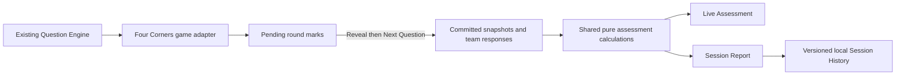

# Shared Assessment Engine and Four Corners Team Mode — review record

Branch: `four-corners-team-assessment`. User review is complete; the approved scope is a feature-branch commit and push only. Earlier verification notes below preserve the review history. The pre-existing edits in `content/reports/TOMORROW_SPOT_CHECK.md` remain untouched. The 264 questions, their explanations, source metadata, audit records, and visuals are unchanged.

## Architecture



`src/assessment/engine.ts` defines game-independent session/team/question/response types, immutable commits, session finalization, runtime validation, and pure accuracy/score summaries. Subjects and game types are strings; neither calculation nor report assumes Science/Social Studies/ELA. Math and Music are covered in generic-engine tests, but Math remains excluded from Four Corners. Future games can provide different point values and response subsets. Four Corners supplies all active teams as attempts, with one point for correct and zero otherwise.

`src/games/four-corners/engine.ts` is the game adapter. `beginGame` creates anonymous numbered teams; `toggleCorrectTeam` changes pending marks only; `advanceRound` snapshots the prompt/subject/existing standard and commits all team outcomes once; `finishEarly` excludes the visible question. There is no inferred concept or invented standard. Old saves without mode/session fields still resume as Classic, with no fabricated team results. Legacy Classic question progress is retained when a report is created; its session timestamp starts when assessment tracking begins because old saves lack a start timestamp.

`src/assessment/storage.ts` stores completed snapshots/responses in `curricuplay.sessions.v1`. Current Four Corners play—including pending marks—is saved under the existing `curricuplay.four-corners.v1` key. History writes are idempotent by session ID, preserve other reports, and never replace corrupt history with an empty collection. Failed history saves leave the completed report available for retry. Reset/Change Grade archive committed work before starting over. Reports derive from their own snapshots and do not depend on the current question bank.

Jeopardy's game, question data, shared curriculum/review services, App integration, and regression tests were not changed. Its `curricuplay.game.v1` state and teacher decisions in `curricuplay.reviews.v1` remain separate. No account, backend, database, student login, name entry, or external request was added.

## Teacher flow

New games default to Team Mode, six teams, and Play Until I Stop. Team count can be changed from 1 through 12. Classic Mode remains available and defaults to 15 rounds. Team instructions specify one independent runner per team, no discussion, and physical runner rotation by the teacher.

A compact scoreboard remains above the question. Reveal enables large team buttons; tap toggles +1 and tap again removes it. Clear Round removes all pending marks without changing prior committed scores. The scoreboard includes pending marks; Live Assessment explicitly excludes them. Next Question commits the round. End Game is available in every active game, including fixed-round games, and requires confirmation. Revealed-but-uncommitted questions are excluded just like unrevealed ones.

Live Assessment and Session Report show overall accuracy, completed questions, attempts, dynamic subject accuracy, team scores and accuracies, and the highest/lowest question results with actual fractions. Reports use neutral labels (“Highest accuracy”, “Most challenging”). Large reports use touch-friendly pages. History can be opened from setup or the completed report. Classic reports show completed questions and explain that no team responses were collected.

## Files changed

| Path | Change |
|---|---|
| `src/assessment/engine.ts` | New shared types, calculations, immutable commit/finalization, validation |
| `src/assessment/storage.ts` | New versioned completed-session persistence |
| `src/assessment/AssessmentView.tsx` | New reusable live and final report UI |
| `src/assessment/AssessmentDialog.tsx` | New modal wrapper with native focus management |
| `src/assessment/SessionHistory.tsx` | New paginated browser history and report reopening |
| `src/assessment/assessment.css` | New scoped report/modal styles |
| `src/games/four-corners/engine.ts` | Team setup/state, legacy recovery, scoring and session adapter |
| `src/games/four-corners/FourCorners.tsx` | Mode choice, scoreboard, scoring buttons, live/report/history integration |
| `src/games/four-corners/four-corners.css` | Team gameplay and setup layout |
| `tests/assessment-engine.spec.ts` | New pure-engine tests |
| `tests/four-corners-team.spec.ts` | New Team Mode/persistence/layout integration tests |
| `tests/four-corners.spec.ts` | Existing whole-class tests now explicitly select Classic and confirm End Game; no assertions removed |
| `content/reports/FOUR_CORNERS_TEAM_MODE_REVIEW.md` | This review record |

## Visual review artifacts

Generated locally by Playwright under ignored `test-results/`:

- `team-mode-scoring.png`: six-team gameplay, pending +1 marks, Clear Round, and next control.
- `team-twelve-gameplay.png`: twelve-team controls at 1920×1080.
- `team-live-assessment-real.png`: live six-team subject results after 17 committed rounds, with a close control and explicit committed-only note.
- `team-session-report-real.png`: final scoreboard, 17 questions / 102 attempts, per-subject percentages with fractions, and question insights.

The gameplay, six-team live view, and final report screenshots were inspected visually. Automated overflow checks exercise all real question pools, visuals, printed-letter items, and report pagination at 1920×1080.

## Verification and limitations

Commands:

```bash
npm run content:validate
python3 scripts/validate-four-corners.py
npx playwright test --workers=2
npm run build
npm run dev -- --host 127.0.0.1
```

The two content validators passed with zero errors. Production build passed with the existing nonblocking >500 kB Vite chunk-size warning.

Earlier testing found report overflow for 8/12 teams; pagination was corrected and those checks passed without relaxing assertions. One full-suite run recorded 88 passes and one interrupted Classic test: source whitespace cleanup triggered a Vite reload during `page.evaluate`. The final run freezes source files and repeats the suite; its result is recorded below.

Coverage includes scoring toggle/clear, committed response mapping, weighted class/team/subject percentages, zero attempts, dynamic subjects, 1/6/8/12 teams, real K–5 pool exhaustion with no repeats, stops after exactly 17/23/41 rounds, unfinished-question exclusion, fixed-round completion, refresh recovery, old Classic saves, new browser context history, corrupt state/history, storage failures, report reopening/pagination, and the existing Jeopardy regressions.

History is local to this browser/origin and depends on browser storage availability. There is no cross-device sync or export. Clearing browser storage removes local reports. The UI deliberately caps team count at 12 for this Smart Board release. Concept metadata is optional; the current question bank does not supply a distinct concept field, so insights use question prompts rather than inventing concept labels.

Final results: **90/90 full-suite tests passed (2.7 minutes)**: 32 existing Four Corners tests, 17 new Team Mode integration tests, four pure assessment-engine tests, and all 37 unchanged Jeopardy/content/review regressions. A final screenshot review found the generic app hover rule darkening selected team/report buttons; scoped selectors fixed the contrast. The affected **17/17 Team Mode tests passed again (37.3 seconds)** with new computed-color assertions and regenerated screenshots. Production build passed again after that fix; the bundle warning remains nonblocking. `git diff --check` passed. No question data, Jeopardy code, or teacher review data changed. No commit, push, merge, or deployment was performed; user review is the next step.

## Six-team color defaults

Exactly six teams now default, in order, to Orange, Purple, Green, Yellow, Red, and Blue. Other counts keep numbered names. New `src/games/four-corners/teams.ts` owns the Four Corners defaults and a display-only adapter for older six-team sessions. New `src/assessment/TeamName.tsx` renders a written name with an optional color accent across scoring, scoreboards, live assessment, final reports, and reopened history reports. The shared model accepts optional validated hex accents; it contains no Four Corners naming policy. `SessionHistory` accepts an optional presentation adapter so historical records need not be rewritten. IDs remain `team-1` through `team-6`; responses, scores, question snapshots, and stored historical records are preserved. Existing custom names are not overwritten.

Validation for this update: production build passed (same nonblocking chunk-size warning). All 22 relevant assessment/Team Mode tests passed across the initial run and focused rerun: 21 initially passed; the added historical-name test used an end timestamp preceding its actual committed response, which correctly triggered history validation. Its fixture now derives the timestamp from the committed response, and it passed on rerun. The new test checks exact name/order/accent values, original IDs, unchanged committed responses after refresh, names in live/final/history views, and byte-equivalent historical record content. Existing tests continue to cover other team counts and 1920×1080 layouts. Nothing committed, pushed, or deployed.

## Optional movement countdown — September 18

Current working branch is `four-corners-team-assessment` (the branch already checked out when this timer task began). Team setup offers Off, 10, 15, and 20 seconds; default 10. Classic stays timer-free. The teacher explicitly taps Start after reading. Countdown is silent and optional; there is no audio dependency. At zero it displays TIME! without revealing, scoring, advancing, or collecting any assessment response. Restart and Cancel are available while the countdown is visible. Manual Reveal stops/hides it and restores the team scoring controls. Next Question and a new/reset game mount a fresh, idle timer.

New files: `src/games/four-corners/movementTimer.ts` (duration validation, monotonic remaining-time calculation, isolated timer storage), `src/games/four-corners/MovementTimer.tsx` (timer UI only), and `tests/four-corners-timer.spec.ts`. Four Corners setup/state and scoped CSS carry the duration preference and mount the timer. No assessment calculations, question content, scoring transitions, or Jeopardy code were changed for this timer update.

Timer status uses `curricuplay.four-corners.timer.v1`, scoped to session ID plus question ID and duration. An actively counting saved timer restores reset with an explicit teacher notice; it never guesses elapsed wall-clock time. Expired timers restore TIME!. Corrupt timer data resets only the timer. The game/session and teacher review storage keys remain separate.

The large countdown uses the pre-reveal scoring area and leaves Reveal Answer accessible. The existing before-reveal disabled-scoring assertion is still tested with timer Off; name assertions run when scoring controls appear after Reveal. Layout checks now include the countdown and timer buttons. Focused verification passed 25 tests across timer/Team Mode, including every K–5 question pool and twelve-team visual/long-text cases. Initial glyph line-box overflow was corrected by increasing the countdown line height; no overflow assertions were relaxed. Full-suite and final build results follow below.

Timer final verification: **98/98 full-suite tests passed (2.8 minutes)** — seven timer tests, 18 Team Mode tests, 32 existing Four Corners tests, four assessment-engine tests, and all 37 existing Jeopardy/content/review regressions. Production build passed with the existing nonblocking bundle-size warning. No-scroll checks passed at 1920×1080, including timer digits/buttons, every current question pool, twelve teams, visuals, printed letters, and longest text. `test-results/four-corners-timer-countdown.png` and `test-results/four-corners-timer-time.png` show the countdown and expiration states. Nothing committed, pushed, merged, or deployed.

## Final pre-commit verification — September 18

Both content validators passed: `npm run content:validate` (zero errors or warnings) and `python3 scripts/validate-four-corners.py` (zero errors, 264 audited questions, zero unreviewed changes). The frozen-source final run of `npx playwright test --workers=2` passed **98/98 tests (2.9 minutes)**: 32 Classic Four Corners, 18 Team Mode, seven timer, four assessment-engine, and 37 unchanged Jeopardy/content/review regression tests. This includes the 1920×1080 layout checks. `npm run build` passed with the existing nonblocking chunk-size warning. No tests were weakened.

The reviewed commit scope is the 18 feature, test, and review-report files. No question content, Jeopardy source, credentials, or environment files are included. Unrelated `TOMORROW_SPOT_CHECK.md` edits remain local and excluded. Push only `four-corners-team-assessment`; do not merge to main or manually promote production.
